## ChatBot 

## Creation du service
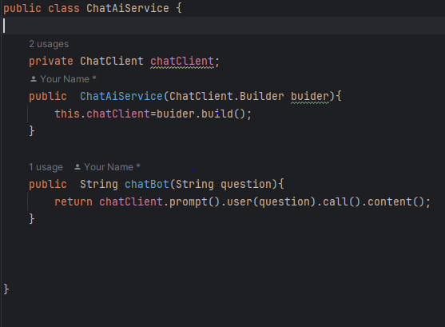

## Creation du controller
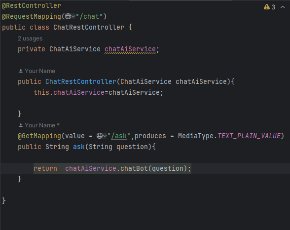

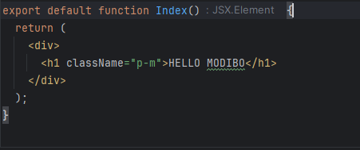

## Configuration de properties pour le llm utilisé

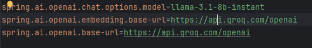

## Vaadin

1- Creation de la vue du composant Index
        
2- Creation de la vue du compsant chat
    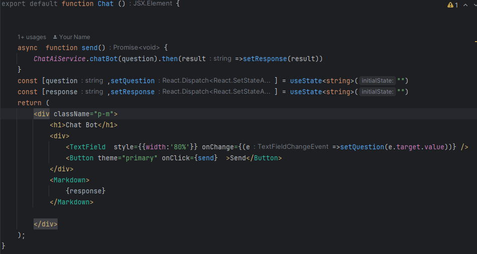

3 - Creation de la vue Principal
    

4- Visualisation

5- Test
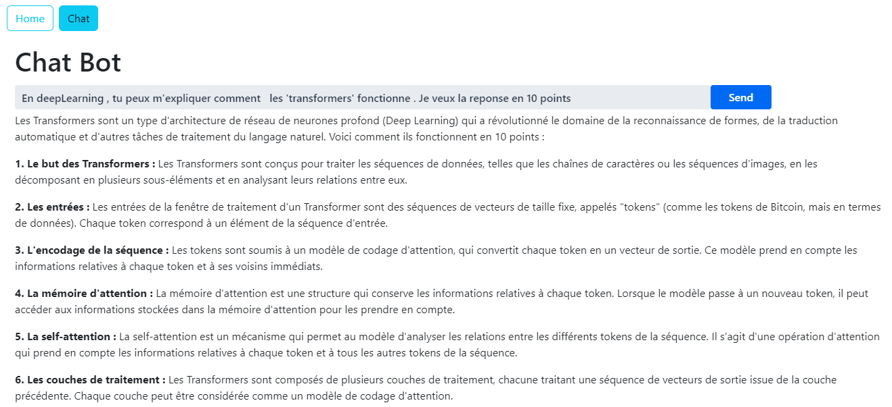
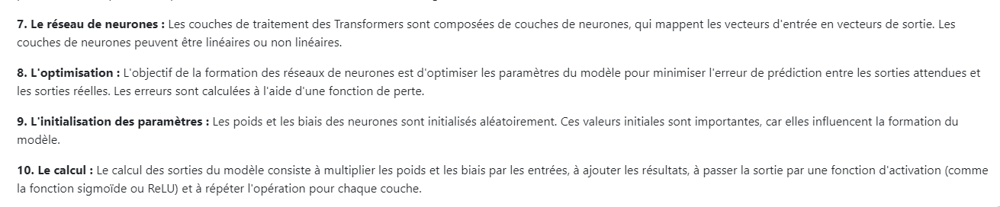

# Rag 

1- Avec H2DB

a- Ajout des dependences

b- Configuration du model
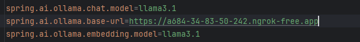

c- Creation de la fonction split et de d'ajout dans le fichier json
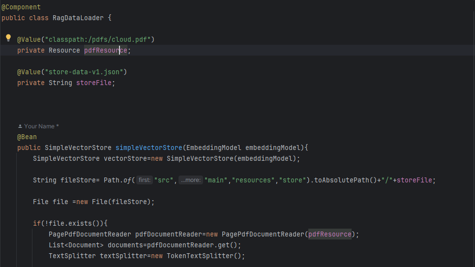
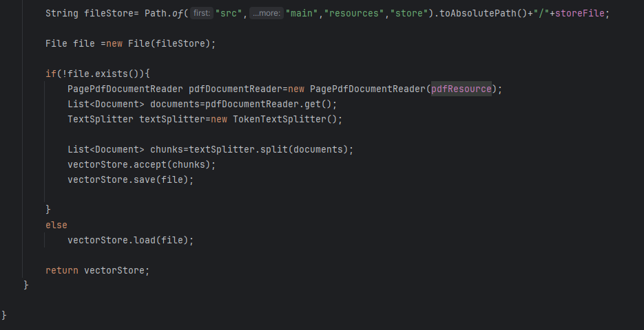

d- Contenu du fichier json

e- Test
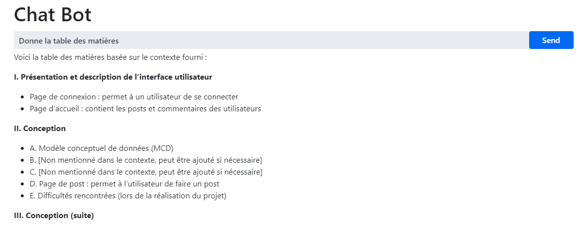