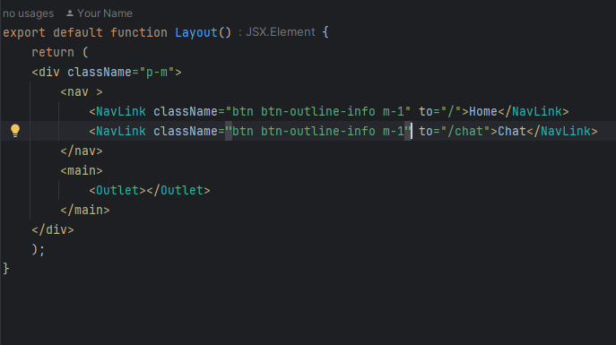
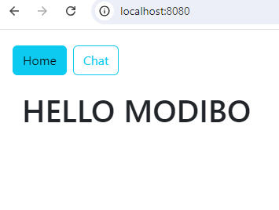
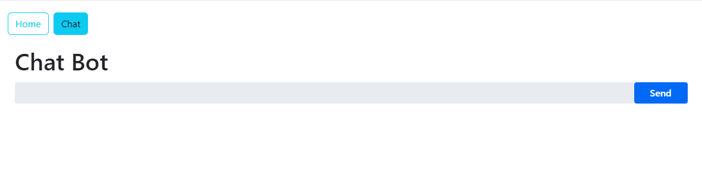

## ChatBot 

## Creation du service

## Creation du controller

## Configuration de properties pour le llm utilisé

## Vaadin

1- Creation de la vue du composant Index
        
2- Creation de la vue du compsant chat
    

3 - Creation de la vue Principal
    

4- Visualisation

5- Test

